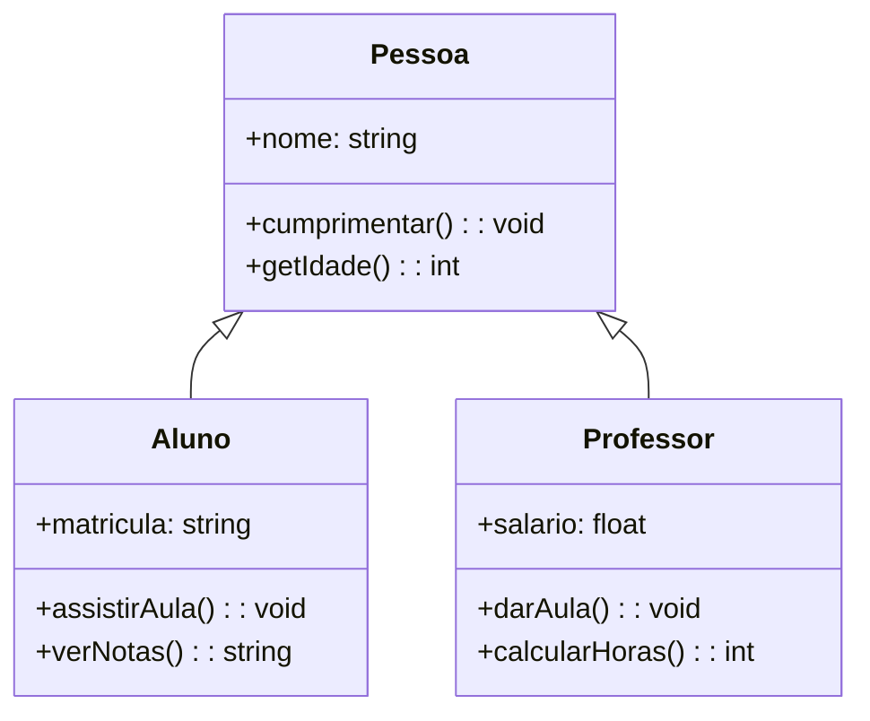

```mermaid
classDiagram
  class Pessoa {
    +nome: string
    +cumprimentar(): void
    +getIdade(): int
  }

  class Aluno {
    +matricula: string
    +assistirAula(): void
    +verNotas(): string
  }

  class Professor {
    +salario: float
    +darAula(): void
    +calcularHoras(): int
  }

  Pessoa <|-- Aluno
  Pessoa <|-- Professor
```
