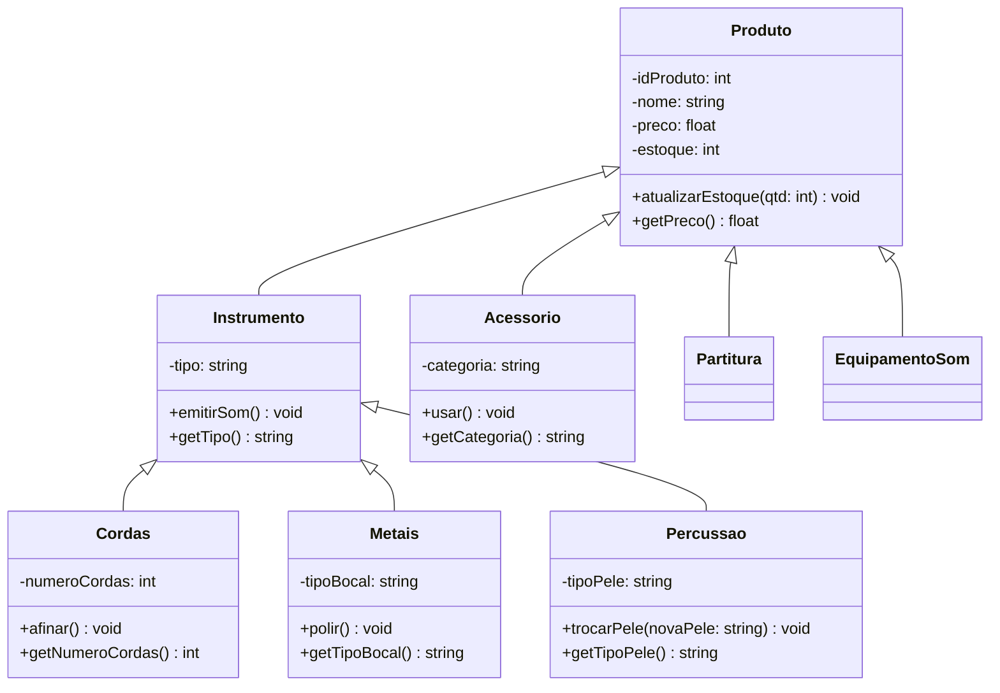

```mermaid
classDiagram
 Produto <|-- Instrumento
 Produto <|-- Acessorio
Produto <|-- Partitura
Produto <|-- EquipamentoSom
Instrumento <|-- Cordas
Instrumento <|-- Metais
 Instrumento <|-- Percussao
 class Produto {
 -idProduto: int
-nome: string
 -preco: float
 -estoque: int
+atualizarEstoque(qtd: int) void
+getPreco() float
 }
class Instrumento {
-tipo: string
+emitirSom() void
+getTipo() string
 }
 class Acessorio {
 -categoria: string
+usar() void
 +getCategoria() string
}
class Cordas {
 -numeroCordas: int
+afinar() void
+getNumeroCordas() int
}
class Metais {
-tipoBocal: string
 +polir() void
+getTipoBocal() string
 }
class Percussao {
 -tipoPele: string
+trocarPele(novaPele: string) void
 +getTipoPele() string
 }
```
