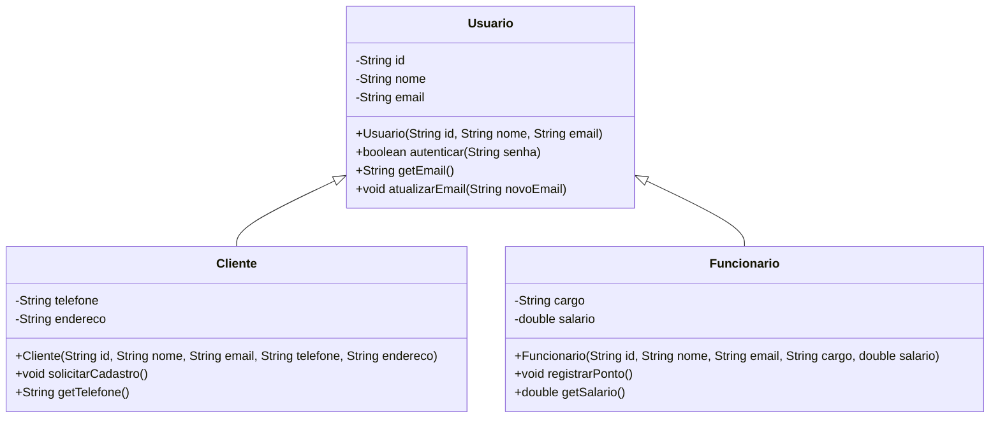

```mermaid
classDiagram
direction TB

class Usuario {
  -String id
  -String nome
  -String email
  +Usuario(String id, String nome, String email)
  +boolean autenticar(String senha)
  +String getEmail()
  +void atualizarEmail(String novoEmail)
}

class Cliente {
  -String telefone
  -String endereco
  +Cliente(String id, String nome, String email, String telefone, String endereco)
  +void solicitarCadastro()
  +String getTelefone()
}

class Funcionario {
  -String cargo
  -double salario
  +Funcionario(String id, String nome, String email, String cargo, double salario)
  +void registrarPonto()
  +double getSalario()
}

Usuario <|-- Cliente
Usuario <|-- Funcionario
```
